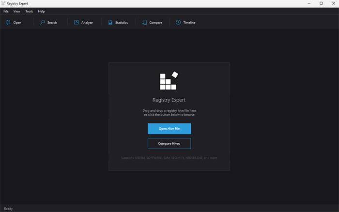
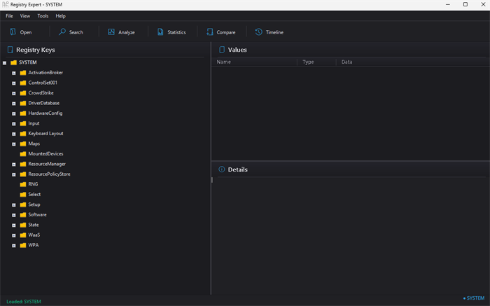
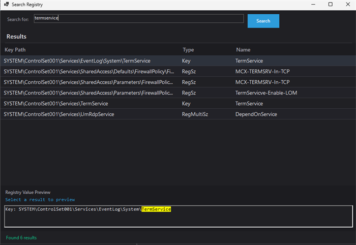
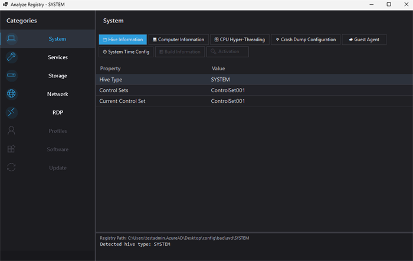
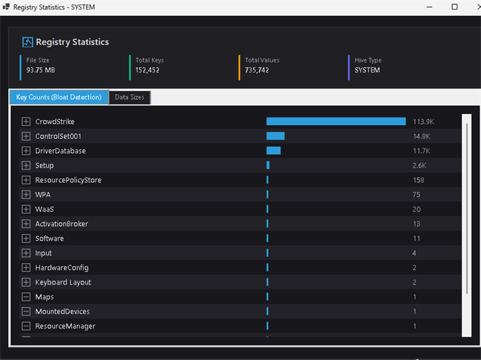
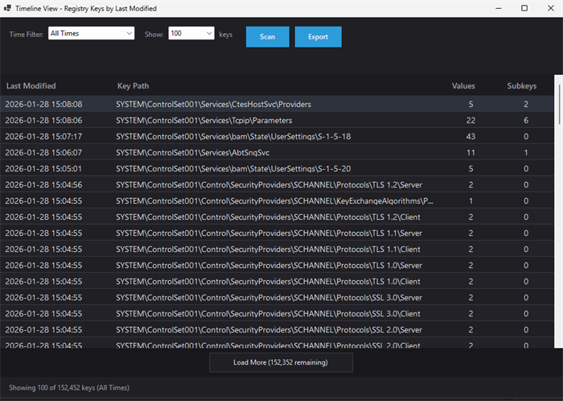
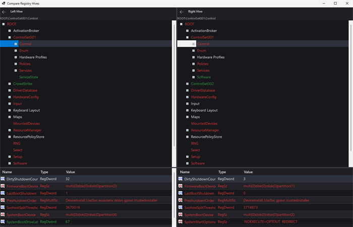

# Registry Expert

Offline Windows registry hive viewer and analyzer for Azure VM support engineers.

 

## Download

**[Download Latest Release](../../releases/latest)**

Single portable `.exe` — no installation required. Download `RegistryExpert.exe` and run it.

## Features

### Browse Offline Hives

Open and browse registry hive files extracted from offline VMs. Supports SYSTEM, SOFTWARE, SAM, SECURITY, NTUSER.DAT, USRCLASS.DAT, DEFAULT, Amcache.hve, and BCD. Drag-and-drop a hive file onto the window or use File > Open.

### Search

Full-text search across key paths, key names, value names, and value data. Results show matching keys and values with highlighted preview. Double-click any result to navigate directly to that key in the tree.

### Analyze

One-click deep analysis of the loaded hive, organized into categories based on hive type:

| Category | Hive | What It Extracts |
|----------|------|------------------|
| **System** | SYSTEM, SOFTWARE | Computer name, OS build (with Win11 detection), timezone, last shutdown, crash dump config, time sync (NTP/w32time), CPU hyper-threading settings |
| **Guest Agent** | SYSTEM, SOFTWARE | Azure Guest Agent version, RdAgent version, VM ID, installed Azure extensions with state |
| **Profiles** | SAM, SOFTWARE, NTUSER.DAT | Local user accounts, user profiles with last logon times, recent documents, typed paths, run history, program usage (UserAssist) |
| **Services** | SYSTEM | Full service list filterable by start type (Boot, System, Auto, Manual, Disabled, Delayed Auto-Start) with image paths |
| **Software** | SOFTWARE, NTUSER.DAT | Installed programs (64-bit and 32-bit), startup programs (Run/RunOnce), Appx packages (inbox vs. user-installed) |
| **Storage** | SYSTEM | Disk filters and volume filters |
| **Network** | SYSTEM, SOFTWARE | Network adapters (IP, DNS, DHCP, gateway, driver version, stale/ghosted NIC detection), DNS registered adapters, network profiles, wireless SSIDs, network shares, firewall rules by profile (Domain/Private/Public) with color-coded block rules, TLS/SSL protocol status (SSL 2.0 through TLS 1.3) |
| **RDP** | SYSTEM | RDP configuration (port, NLA, encryption, security layer), session limits, Citrix detection, RDP licensing, RDS license servers, grace period |
| **Update** | SOFTWARE | Windows Update settings |

### Statistics

Dashboard showing hive file size, total keys, total values, and hive type. Includes two tabs for **Key Counts (Bloat Detection)** and **Data Sizes** with expandable tree views and bar charts to identify registry bloat.

### Timeline

Scans all registry keys by last-modified timestamp. Filter by time range (last hour, 24 hours, 7 days, 30 days, or custom range) and sort by date. Useful for identifying what changed during an incident window. Export results to CSV.

### Compare

Side-by-side comparison of two registry hives of the same type. Color-coded diff view: green highlights keys unique to one hive, red highlights keys with changed values. Synchronized tree navigation between left and right panes.

### Additional

- **Export Key** — Export any selected key and all its subkeys to a text file
- **Value Inspector** — Double-click any value to see interpreted data and raw hex dump
- **Dark / Light Theme** — Switch via View menu; preference is remembered
- **High DPI Support** — Scales correctly on 125%, 150%, 200% displays and across monitors
- **Auto-Update Check** — Checks GitHub releases for new versions on startup

## Usage

1. **Open a hive** — Drag-and-drop a hive file onto the window, or use **File > Open Hive** (Ctrl+O). The tree view populates with the registry key hierarchy and the right panel shows values for the selected key.

2. **Browse** — Expand keys in the tree. Click a value to see its type, data, and hex dump in the details pane. Right-click to copy key paths or value data.

3. **Search** — Press **Ctrl+F** to open Search. Type a term and results appear across all keys, names, and data. Double-click a result to jump to it in the main tree.

4. **Analyze** — Press **F5** to run analysis. Select a category on the left (System, Network, Services, etc.) and browse the extracted information. Click any row to see the raw registry path and value in the detail pane.

5. **Timeline** — Press **Ctrl+T** to scan modification timestamps. Set a time filter to narrow down changes to an incident window. Export to CSV for further analysis.

6. **Compare** — Press **Ctrl+M** to compare two hives. Load a second hive of the same type and run the diff. Green nodes are unique to one side; red nodes have value differences.

7. **Statistics** — Press **Ctrl+I** to see key counts and data sizes. Use the bloat detection tab to find keys with excessive subkeys or large data.
